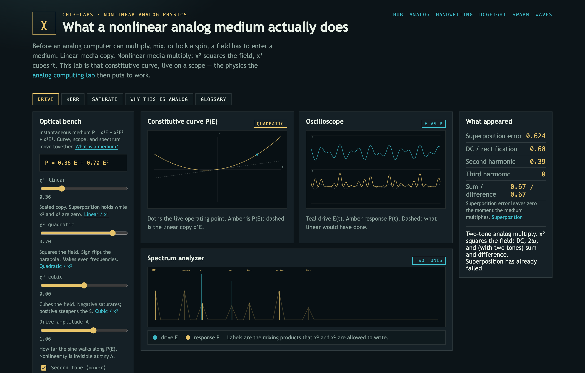
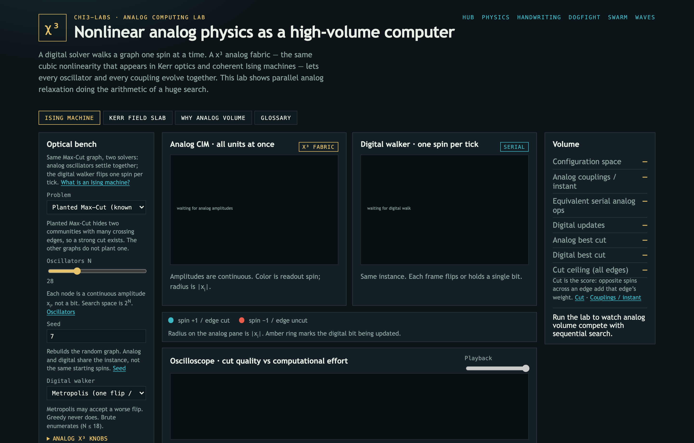
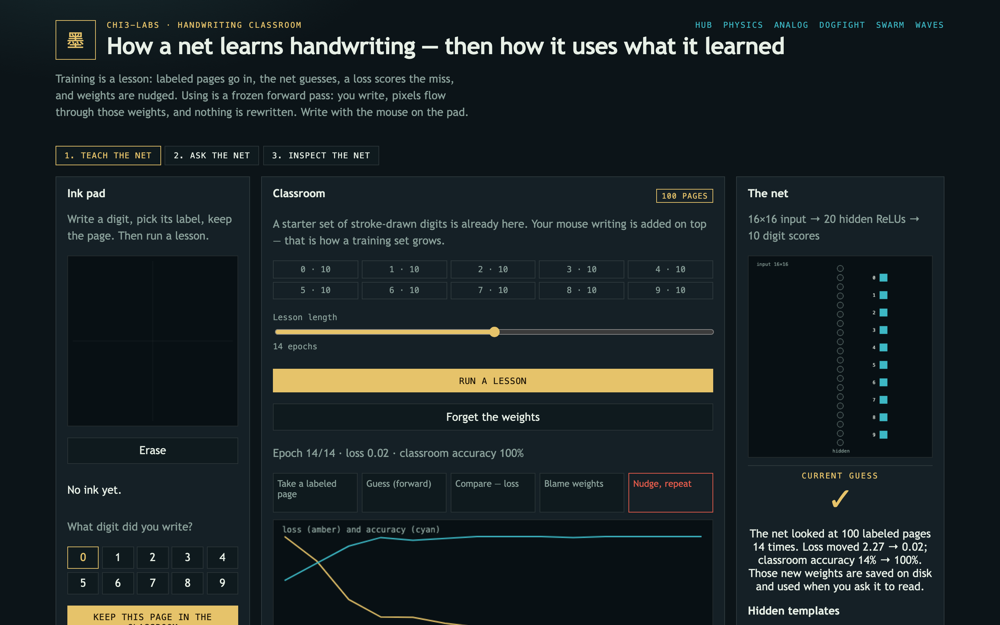
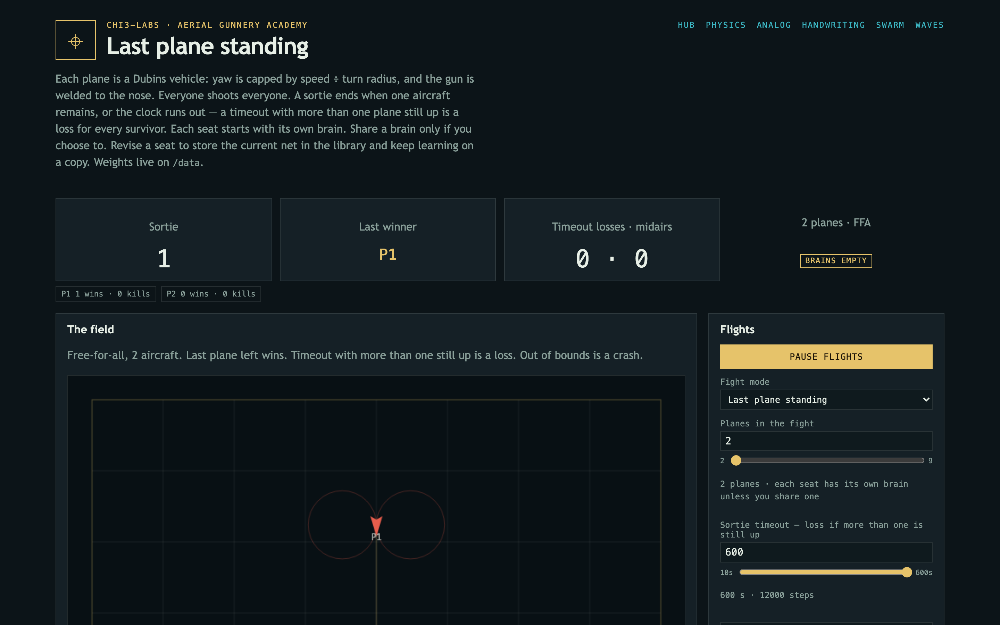
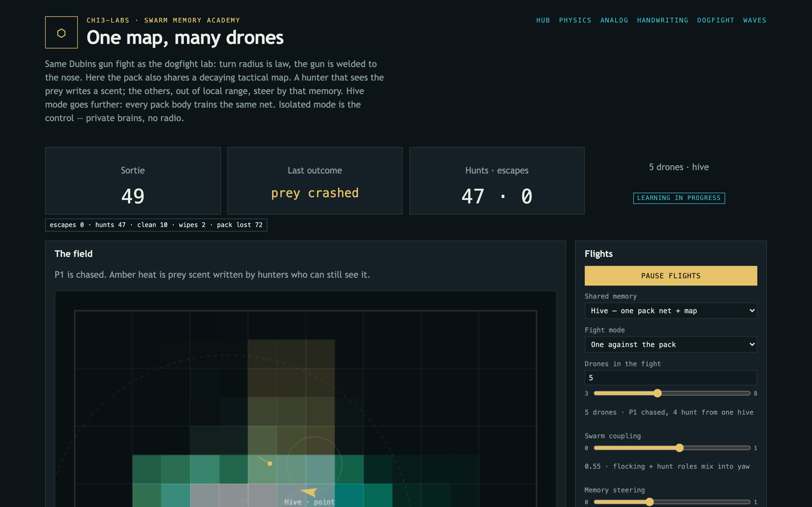
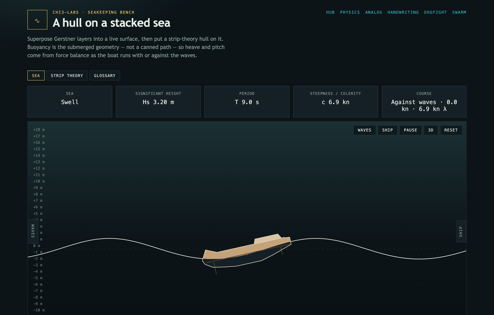

# Chi3-labs

Educational labs on nonlinear analog physics, analog computing, how small
neural nets **train** versus **use** what they learned, how a pack of drones
shares memory, and how a hull rides a stacked sea.

Turn a knob and a medium writes new frequencies. Teach a tiny net, then freeze
it and read the templates. Send a pack that shares one map. Put a hull on a sea
that actually pushes back.

A Caddy proxy sits in front of the labs so they share one origin.

<table>
  <tr>
    <td width="50%">
      <a href="apps/nonlinear-physics-lab"></a>
      <p><strong>Physics — when the medium starts to multiply.</strong> Linear is a copy. χ² squares the field; χ³ cubes it. New lines appear on the spectrum because the physics wrote them.</p>
    </td>
    <td width="50%">
      <a href="apps/analog-chi3-lab"></a>
      <p><strong>Analog — the whole graph relaxes at once.</strong> A digital walker flips one spin per tick. A Kerr slab and a CIM let every coupling happen in the same instant.</p>
    </td>
  </tr>
  <tr>
    <td width="50%">
      <a href="apps/handwriting-ai-lab"></a>
      <p><strong>Handwriting — a lesson writes the weights. Asking does not.</strong> Draw a digit, run a lesson, then freeze the net and inspect the templates.</p>
    </td>
    <td width="50%">
      <a href="apps/dogfight-ai-lab"></a>
      <p><strong>Dogfight — empty brains. Welded guns. Last plane standing.</strong> Yaw is capped by turn radius. They learn by crashing, missing, and not dying.</p>
    </td>
  </tr>
  <tr>
    <td width="50%">
      <a href="apps/swarm-memory-lab"></a>
      <p><strong>Swarm — one hunter's eyes become the pack's map.</strong> Prey scent decays on a 16×16 blackboard. Isolated, blackboard, or hive.</p>
    </td>
    <td width="50%">
      <a href="apps/wave-rider-lab"></a>
      <p><strong>Waves — heave from the hull, not a canned path.</strong> Stack Gerstner layers and let strip-theory buoyancy pitch the boat in real time.</p>
    </td>
  </tr>
</table>

| Path | Project |
| --- | --- |
| [`/`](proxy) | Lab directory |
| [`/physics/`](apps/nonlinear-physics-lab) | χ¹ / χ² / χ³ constitutive physics: mixing, Kerr phase, saturating well |
| [`/analog/`](apps/analog-chi3-lab) | Analog Ising / CIM relaxation vs sequential digital search, plus a Kerr field slab |
| [`/handwriting/`](apps/handwriting-ai-lab) | Handwriting classroom: mouse-drawn digits, training loop, then frozen inference |
| [`/dogfight/`](apps/dogfight-ai-lab) | Empty policies learn a 2-D turn-radius gun fight by trial and error |
| [`/swarm/`](apps/swarm-memory-lab) | Same gun fight with a shared tactical map, swarm roles, and hive weights |
| [`/waves/`](apps/wave-rider-lab) | Gerstner sea stack and strip-theory seakeeping: heave and pitch on a live hull |

## Quick start

```bash
docker compose up --build
```

Then open [http://localhost:8080](http://localhost:8080). Each subproject
also has its own `docker-compose.yml` so it can be started from its own
folder without the proxy.

## Railway

Deploy **seven services** from this repo. Only the proxy should have a
public domain; the labs talk to it over Railway private networking.

| Service name | Root directory | Public | Notes |
| --- | --- | --- | --- |
| `nonlinear-physics-lab` | `apps/nonlinear-physics-lab` | no | Set `PORT=8080` |
| `analog-chi3-lab` | `apps/analog-chi3-lab` | no | Set `PORT=8080` |
| `handwriting-ai-lab` | `apps/handwriting-ai-lab` | no | Set `PORT=8081`. Attach a volume at `/data` |
| `dogfight-ai-lab` | `apps/dogfight-ai-lab` | no | Set `PORT=8082`. Brains stay in the browser |
| `swarm-memory-lab` | `apps/swarm-memory-lab` | no | Set `PORT=8083`. Brains stay in the browser |
| `wave-rider-lab` | `apps/wave-rider-lab` | no | Set `PORT=8080` |
| `proxy` | `proxy` | yes | Generate the public domain here |

`PORT` on each lab must be a **service variable** in the Railway dashboard
(8080 for analog, physics, and waves, 8081 handwriting, 8082 dogfight, 8083 swarm). `${{service.PORT}}`
does not pick up the runtime `PORT` Railway injects, so the proxy would get
`host:` and return 502.

On the **proxy** service:

| Variable | Value |
| --- | --- |
| `PHYSICS_UPSTREAM` | `${{nonlinear-physics-lab.RAILWAY_PRIVATE_DOMAIN}}:${{nonlinear-physics-lab.PORT}}` |
| `ANALOG_UPSTREAM` | `${{analog-chi3-lab.RAILWAY_PRIVATE_DOMAIN}}:${{analog-chi3-lab.PORT}}` |
| `HANDWRITING_UPSTREAM` | `${{handwriting-ai-lab.RAILWAY_PRIVATE_DOMAIN}}:${{handwriting-ai-lab.PORT}}` |
| `DOGFIGHT_UPSTREAM` | `${{dogfight-ai-lab.RAILWAY_PRIVATE_DOMAIN}}:${{dogfight-ai-lab.PORT}}` |
| `SWARM_UPSTREAM` | `${{swarm-memory-lab.RAILWAY_PRIVATE_DOMAIN}}:${{swarm-memory-lab.PORT}}` |
| `WAVE_UPSTREAM` | `${{wave-rider-lab.RAILWAY_PRIVATE_DOMAIN}}:${{wave-rider-lab.PORT}}` |

If those are unset, the proxy defaults to
`<service-name>.railway.internal` plus the ports above — only if the
Railway service names match this table.

Leave each service's start command empty so the Dockerfiles run. The Python
lab images bind dual-stack (`--host ''`) so Railway's private IPv6 network can
reach them; IPv4-only `0.0.0.0` makes the hub work and every `/physics/`,
`/analog/`, `/handwriting/`, `/dogfight/`, `/swarm/`, `/waves/` URL 502. Do not put `VOLUME` in the
handwriting Dockerfile; mount the Railway volume at `/data`, never `/app` or
`/lab`. Dogfight and swarm keep brains in the browser, so they do not need a volume.
