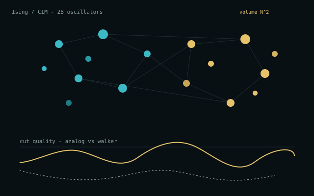

# χ³ Analog Lab



Educational simulation of **analog nonlinear (χ³) computing**: a coherent Ising
machine that relaxes a Max-Cut instance in analog time, shown next to a digital
walker that flips one spin per tick, plus a Kerr-slab field processor that
applies |E|²E to every pixel at once.

## Run with Docker Compose

From the monorepo root:

```bash
docker compose up --build
```

Or from this directory:

```bash
docker compose up --build
```

Open [http://localhost:8080](http://localhost:8080) from this folder, or
[http://localhost:8080/analog/](http://localhost:8080/analog/) from the
monorepo root (through the proxy).

## Run without Docker

```bash
python -m pip install -r requirements.txt
uvicorn app.main:app --host 0.0.0.0 --port 8080
```

## What it teaches

Digital search inspects configurations sequentially. A χ³ analog fabric
instantiates every pairwise product as a physical coupling and saturates each
oscillator with a cubic (Kerr) term:

```
ẋᵢ = (p − 1) xᵢ − xᵢ³ + ξ Σⱼ Jᵢⱼ xⱼ
```

The computational **volume** is the N² interactions that occur in each analog
instant. The lab does not claim a complexity-class breakthrough; it shows why
analog nonlinear media can deliver that volume in physical time.

## Glossary

These words are also in the app (Glossary tab, and as hints on the optical bench).

**Ising machine.** A classroom Coherent Ising Machine (CIM). N analog oscillators
with amplitudes `xᵢ` settle into spins `sᵢ = sign(xᵢ) = ±1`. That pattern is a
Max-Cut guess. The analog fabric evaluates every pairwise product at once; a
digital walker flips one spin per tick:

```
ẋᵢ = (p − 1) xᵢ − xᵢ³ + ξ Σⱼ Jᵢⱼ xⱼ + η
```

`(p−1)xᵢ` is pump/gain, `−xᵢ³` is χ³ saturation, `ξ Jx` is all-to-all coupling,
`η` is noise. Energy `H = ½ sᵀ W s` is minimized by using `J = −W`, which
maximizes the cut.

**Oscillators N.** Each node is a continuous amplitude, not a bit. Graph color is
the readout spin; analog radius is `|xᵢ|`. Search space is `2ᴺ`. Brute force is
only offered for `N ≤ 18`.

**Cut.** The score. An edge is cut when its endpoints have opposite spins:

```
cut = ¼ Σᵢⱼ Wᵢⱼ (1 − sᵢ sⱼ)
```

Teal edges are cut, pink are uncut. **Cut ceiling** is the sum of all edge
weights (every edge cut), often unreachable. Higher cut is better.

**Couplings / instant.** A coupling is one pairwise product `Jᵢⱼ xⱼ`. An analog
**instant** is one ODE sample, in which all `N²` couplings fire together.
**Analog couplings / instant** is `N²`. **Equivalent serial analog ops** is that
volume times the analog step count. **Digital updates** are one spin flip per tick.

**Analog χ³ knobs.** ODE parameters, not the graph.

| Knob | What it does |
| --- | --- |
| Pump ramp end `p` | How hard oscillators are driven. Starts low (explore), ends here (saturate). |
| Coupling `ξ` | Strength of analog `Jx`. Too small ignores the graph; too large overshoots. |
| Analog noise `η` | Brownian kick. A little helps escape shallow cuts. |

**Relax.** Run both machines. Analog relaxation is physical settling: explore at
low pump, then χ³ saturation locks amplitudes toward `±1`. Metropolis may accept
a worse flip; greedy never does; brute enumerates.

**Seed.** Random seed for the graph. Same Problem + N + Seed draws the same
instance. Analog starts from `seed+11`, digital from `seed+3`, so they share the
problem, not the same initial draw.

### How to read a run

1. Pick a problem and N, optionally a seed.
2. Open Analog χ³ knobs if you want to change pump, coupling, or noise.
3. Hit **Relax both machines**.
4. Watch analog nodes grow and flip color; digital nodes flip one at a time.
5. Compare analog best cut vs digital best cut vs cut ceiling.
6. Volume meters count arithmetic: analog pays `N²` couplings every instant.

## Tests

```bash
python -m pip install -r requirements-dev.txt
python -m pytest
```
