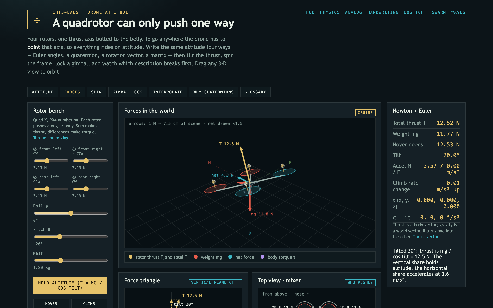

# ✣ Drone Attitude Lab



Educational bench for **how a quadrotor points its one thrust axis**: the
same attitude written as Euler angles, a quaternion, a rotation vector and a
rotation matrix, and the rotor forces and torques that ride on it.

```
m a = R · [0, 0, −ΣFᵢ] + [0, 0, m g]        q̇ = ½ q ⊗ [0, ω]
```

## Run with Docker Compose

From the monorepo root:

```bash
docker compose up --build
```

Or from this directory:

```bash
docker compose up --build
```

Open [http://localhost:8080](http://localhost:8080) from this folder, or
[http://localhost:8080/drone/](http://localhost:8080/drone/) from the
monorepo root (through the proxy).

## Run without Docker

```bash
python -m pip install -r requirements.txt
uvicorn app.main:app --host 0.0.0.0 --port 8080
```

## What it teaches

| Tab | What you do | What you see |
| --- | --- | --- |
| Attitude | Set roll, pitch, yaw; switch Z-Y-X / X-Y-Z | Euler, quaternion, rotation vector and matrix update together; replay three turns vs one turn about r |
| Forces | Drive four rotors, tilt the frame | Thrust, weight and net force in the world; T cos tilt vs mg; torques from the mixer |
| Spin | Hold body rates ω = (p, q, r) | Quaternion integration vs Euler-angle integration; Euler rates spike near pitch ±90° |
| Gimbal lock | Turn three physical rings | Roll and yaw axes align at pitch ±90°; the axis no ring can turn about; 1 / cos θ |
| Interpolate | Pick attitudes A and B | SLERP's single fixed-axis turn vs Euler lerp's longer, uneven path |

Conventions follow PX4 and most aerospace texts: world NED, body FRD,
intrinsic Z-Y-X Euler angles, Hamilton quaternions `[w, x, y, z]` mapping
body to world. Positive roll drops the right arm, positive pitch lifts the
nose, positive yaw turns right.

The browser does its own math for live drawing. [`app/attitude.py`](app/attitude.py)
is the reference copy: the API serves it, and the tests pin it down.

## API

| Endpoint | Body | Returns |
| --- | --- | --- |
| `POST /api/attitude` | `{roll, pitch, yaw}` in degrees | quaternion, matrix, rotation vector, gimbal condition |
| `POST /api/forces` | `{thrusts[4], roll, pitch, yaw, mass}` | world forces, accelerations, body torque, hover thrust |
| `POST /api/mix` | `{collective, torque[3]}` | rotor thrusts and the allocation matrix |
| `POST /api/spin` | `{rates[3] °/s, start, duration}` | quaternion vs Euler-angle integration, Euler rates, drift |
| `POST /api/interpolate` | `{start, end, steps}` | SLERP and Euler-lerp paths and their lengths |
| `GET /api/primer` | — | equations, glossary, conventions |

## Tests

```bash
python -m pip install -r requirements-dev.txt
python -m pytest
```
