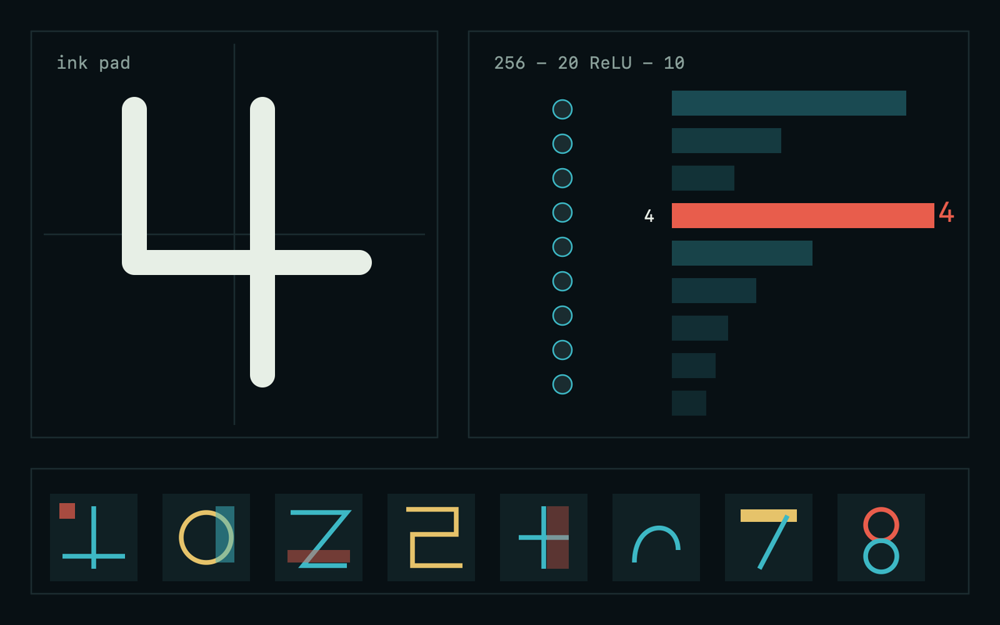

# Handwriting AI Lab



Educational visualization of **training versus using** a neural net, with a
mouse-drawn handwriting pad.

## Run with Docker Compose

From the monorepo root (all labs):

```bash
docker compose up --build
```

Then open [http://localhost:8080/handwriting/](http://localhost:8080/handwriting/).

Or from this directory:

```bash
docker compose up --build
```

Open [http://localhost:8081](http://localhost:8081).

```bash
python -m pip install -r requirements.txt
uvicorn app.main:app --host 0.0.0.0 --port 8081
```

## What it teaches

1. **Teach.** A classroom of labeled 16×16 ink grids is shown to a tiny
   network (256 → 20 ReLU → 10). Each lesson epoch is guess → loss →
   backprop → weight nudge. The loss chalk-line should fall.
2. **Ask.** You write a digit with the mouse. The net only runs the forward
   pass. Weights stay frozen — that is inference.
3. **Inspect.** The 20 hidden templates and the 10×20 vote matrix are shown
   with a short English reading of what each unit is hunting for and which
   digits listen to it.

A starter classroom of stroke-drawn digits is seeded so a lesson works before
anyone writes. Your own handwriting can be added on top.

Weights live on **`/data`** (`model.npz`, `lab.json`). On Railway, attach a
volume at `/data` — never `/app` or `/lab`. The lab honors `HANDWRITING_DATA`
or `RAILWAY_VOLUME_MOUNT_PATH` if you mount elsewhere.

## Tests

```bash
python -m pip install -r requirements-dev.txt
python -m pytest
```
