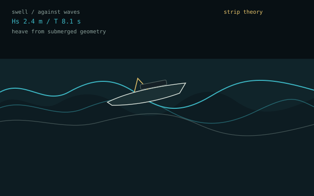

# Wave Lab



Educational seakeeping bench: stack Gerstner seas, steer a hull through them,
and watch **strip-theory buoyancy** heave and pitch the boat. Side view or a
WebGL mesh of the same run.

## Run with Docker Compose

From the monorepo root:

```bash
docker compose up --build
```

Then open [http://localhost:8080/waves/](http://localhost:8080/waves/).

Or from this directory:

```bash
docker compose up --build
```

Open [http://localhost:8080](http://localhost:8080).

## Run without Docker

Frontend (Vite, hot reload):

```bash
npm install
npm run dev
```

Open [http://localhost:5173](http://localhost:5173).

Production layout, same as the other labs:

```bash
npm install
npm run build
python -m pip install -r requirements.txt
uvicorn app.main:app --host 0.0.0.0 --port 8080
```

## What it teaches

The surface is a kinematic stack of Gerstner trains — crests sharpen, troughs
flatten, layers sum. The hull is twenty-five stations. Each station looks up
the local waterline, computes a submerged strip, and contributes buoyancy
`ρ g Δx · stripArea`. Heave and pitch integrate from net force and moment.
The boat is not following a canned path.

Typical loop: Waves → pick a starter → Add to stack → Ship → hull, speed,
heading. Click the sea for an impulse. Space pauses; W / S toggle docks;
V flips 3D; arrows set heading.

## Honest limits

This is a real-time illustration, not CFD. The sea does not feel the hull
(no radiated or diffracted waves). Section buoyancy sliders are classroom
gains, not foil tables. Constants: seawater ρ = 1025 kg/m³, g = 9.81 m/s².

## Tests

```bash
python -m pip install -r requirements-dev.txt
npm run build
python -m pytest
```

On Railway (behind the monorepo proxy):

- Set this service **Root Directory** to `apps/wave-rider-lab`.
- Do **not** generate a public domain here. The `proxy` service is the
  public entry; this lab is reached at `/waves/` over private networking.
- Set `PORT=8080` as a **service variable** and leave the start command
  empty so uvicorn listens on `$PORT` (IPv4 and IPv6).
